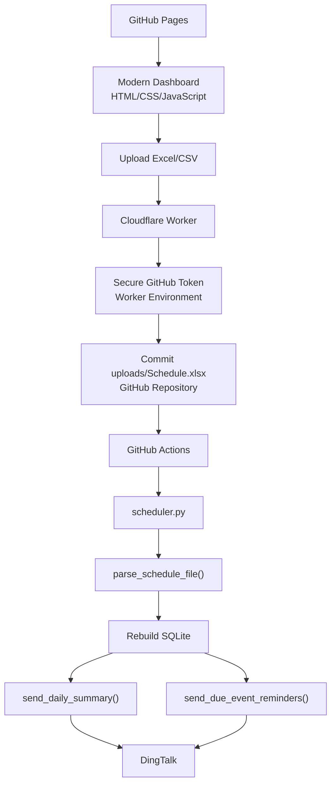

# Task DingTalk Scheduler

Production-ready scheduler for engineer duty schedules. Uploads happen from GitHub Pages, files are committed by a Cloudflare Worker, GitHub Actions rebuilds SQLite from `uploads/Schedule.xlsx`, and DingTalk receives the existing daily summary and reminder format.

## Architecture



## What Changed

- `docs/` hosts the GitHub Pages dashboard.
- `worker/` contains the Cloudflare Worker upload API.
- `build_calendar.py` converts `uploads/Schedule.xlsx` into `docs/data/schedule.json`.
- `repository.py` owns SQL access.
- `scheduler.py` rebuilds SQLite from `uploads/Schedule.xlsx` every run.
- Flask remains available for local development only.
- DingTalk message formatting and `schedule_parser.py` parsing logic are unchanged.

## Project Tree

```text
.
├── .github/
│   └── workflows/
│       └── dingtalk.yml
├── data/
│   └── holidays_id_2026.json
├── docs/
│   ├── data/
│   │   └── schedule.json
│   ├── app.js
│   ├── index.html
│   └── style.css
├── static/
│   └── styles.css
├── templates/
│   └── dashboard.html
├── uploads/
│   ├── .gitkeep
│   └── Schedule.xlsx
├── worker/
│   ├── github_api.js
│   └── index.js
├── app.py
├── config.py
├── dingtalk.py
├── holidays_id.py
├── models.py
├── README.md
├── repository.py
├── requirements.txt
├── schedule_parser.py
├── scheduler.py
├── services.py
└── wrangler.toml
```

`uploads/Schedule.xlsx` is created by the Worker after the first dashboard upload.

## Installation

```powershell
python -m venv .venv
.\.venv\Scripts\Activate.ps1
pip install -r requirements.txt
copy .env.example .env
```

Edit `.env`:

```text
DATABASE_PATH=scheduler.sqlite3
SCHEDULE_FILE=uploads/Schedule.xlsx
DINGTALK_WEBHOOK_URL=...
DINGTALK_SECRET=...
APP_TIMEZONE=Asia/Jakarta
DAILY_NOTIFY_TIME=04:00
REMINDER_LOOKAHEAD_MINUTES=1
HOLIDAY_SYNC_ENABLED=true
```

## Local Development

Flask is still available for local checks:

```powershell
python app.py
```

Open:

```text
http://127.0.0.1:5000
```

Uploads in production should use GitHub Pages, not local Flask.

## GitHub Pages

1. Commit the `docs/` folder.
2. Open repository `Settings`.
3. Go to `Pages`.
4. Set source to `Deploy from a branch`.
5. Select the branch, usually `main`.
6. Select folder `/docs`.
7. Save.
8. Open the published Pages URL.
9. Paste the Cloudflare Worker URL into the dashboard field.

The dashboard supports Excel upload, CSV upload, drag and drop, file preview, progress, toast messages, status cards, manual scheduler run, calendar preview, and statistics.

## Cloudflare Worker

Install Wrangler:

```powershell
npm install -g wrangler
wrangler login
```

Update `wrangler.toml`:

```toml
name = "task-dingtalk-scheduler-upload"
main = "worker/index.js"
compatibility_date = "2026-07-18"

[vars]
GITHUB_OWNER = "your-github-owner"
GITHUB_REPO = "your-repository-name"
GITHUB_BRANCH = "main"
ALLOWED_ORIGIN = "https://your-github-owner.github.io"
DINGTALK_CONFIGURED = "true"
```

Set the GitHub token securely:

```powershell
wrangler secret put GITHUB_TOKEN
```

Deploy:

```powershell
wrangler deploy
```

### Worker Endpoints

```text
GET  /health
GET  /status
POST /upload
POST /run-scheduler
```

Upload expects multipart form data with `schedule_file`.

## Required GitHub Secrets

Add these in repository `Settings > Secrets and variables > Actions`:

```text
DINGTALK_WEBHOOK_URL
DINGTALK_SECRET
```

`DINGTALK_SECRET` can be empty if the DingTalk robot does not use signature security.

## Required Cloudflare Variables

Worker variables:

```text
GITHUB_OWNER
GITHUB_REPO
GITHUB_BRANCH
ALLOWED_ORIGIN
DINGTALK_CONFIGURED
```

Worker secret:

```text
GITHUB_TOKEN
```

The token needs permission to read/write repository contents and dispatch GitHub Actions workflows.

## GitHub Actions

The workflow is in `.github/workflows/dingtalk.yml`.

It runs on schedule and can be manually triggered. Runtime flow:

1. Checkout repository.
2. Install Python dependencies.
3. Run `python scheduler.py`.
4. Initialize SQLite.
5. Build `docs/data/schedule.json` when `uploads/Schedule.xlsx` changes.
6. Parse `uploads/Schedule.xlsx`.
7. Replace schedule tables.
8. Sync holidays.
9. Send daily summary.
10. Send due event reminders.

Generated SQLite files are ignored and should never be committed.

## Deployment Guide

1. Deploy the Worker with GitHub variables and `GITHUB_TOKEN`.
2. Enable GitHub Pages from `/docs`.
3. Open the Pages dashboard.
4. Enter and save the Worker URL.
5. Upload `.xlsx` or `.csv`.
6. Confirm the Worker commits `uploads/Schedule.xlsx`.
7. Confirm GitHub Actions rebuilds `docs/data/schedule.json`.
8. Refresh GitHub Pages and confirm the calendar reads the new JSON.
9. Click `Manual Run Scheduler` or wait for the daily GitHub Actions schedule.
10. Confirm DingTalk receives the existing message format.

## Scheduler Logging

The scheduler prints these production checkpoints:

```text
Scheduler Started
Database Initialized
Schedule Parsed
Tasks Imported
Events Imported
Holiday Synced
Daily Summary Sent
Reminder Sent
Scheduler Finished
```

Holiday sync, daily summary, and reminder steps are isolated. If one of those steps fails, the scheduler logs the error and continues with the next step.
